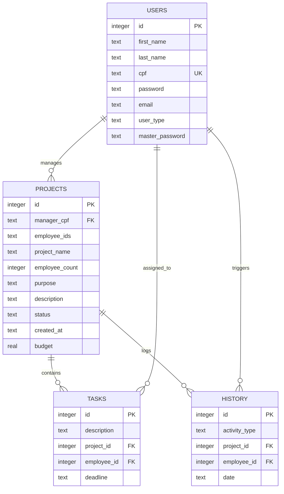

# CLI Project Management System

An interactive command-line interface (CLI) application built with **Python** and **SQLite3** to manage projects, assign tasks, track budgets, and manage user roles (Standard User, Manager, and Master Manager).

This project has been refactored to align with production-grade development standards, incorporating strong security features, connection lifecycle management, automated testing, and input validation.

---

## 🚀 Key Features

* **Multi-Role Authorization**: Supports three user tiers:
  * **Standard User (U)**: View assigned projects and send messages to managers.
  * **Manager (G)**: Create projects, assign tasks to employees, monitor progress, and manage budgets.
  * **Master Manager (GM)**: Access system-level configurations and perform all Manager operations.
* **Robust Security & Cryptography**:
  * **Password Hashing**: Protects user credentials using modern `bcrypt` key derivation instead of plaintext storage.
  * **SQL Injection Prevention**: All persistence operations are secured using parameterized queries (`?` placeholders).
* **Database Session Lifecycle**: Implements a thread-safe connection context manager (`db_session`) which handles connection creation, commits, rollbacks, and guarantees connection closing.
* **Input Validation**:
  * Strict regular expression checks for email formats.
  * CPF length and format validation.
  * Positive numerical boundary checks for project budgets.
* **Automated Test Coverage**: Full suite of unit tests built with `pytest` verifying database operations and logic.

---

## 🏗️ Database Schema

The SQLite database structure is composed of four tables representing users, projects, tasks, and historical activities.



---

## 🛠️ Project Structure

```
abstract-project-management-system/
├── app/
│   ├── utils/
│   │   └── db_methods.py   # Database helper methods & context manager
│   ├── classes.py          # User, Manager, and MasterManager static classes
│   ├── metodos.py          # Interactive CLI menu routing
│   └── main.py             # Entrypoint script
├── tests/
│   └── test_project_manager.py  # Unit test suite
├── .gitignore
├── requirements.txt        # Third-party dependencies (bcrypt, pytest)
└── README.md
```

---

## ⚡ How to Run

### 1. Set Up Environment
Create a virtual environment and install the required dependencies (ensure you have Python 3.12+):

```bash
# Create and activate virtual environment
python -m venv venv
source venv/Scripts/activate     # On Linux/macOS
venv\Scripts\activate            # On Windows

# Install dependencies
pip install bcrypt pytest
```

### 2. Run the Application
Start the interactive CLI menu:
```bash
python -m app.main
```
The database file `GestaoProjetos.db` will be initialized automatically in the project root on the first run.

### 3. Run the Automated Tests
Execute the unit test suite:
```bash
python -m pytest
```
